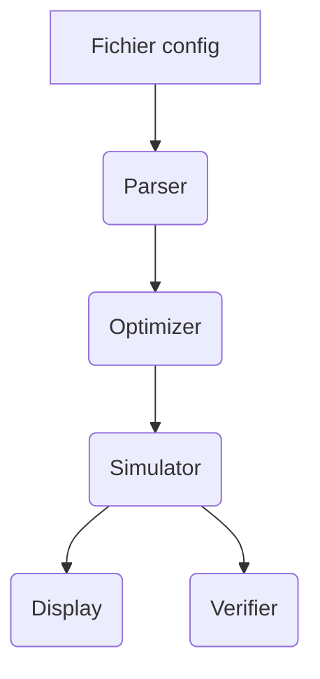

# krpsim


[](https://codecov.io/gh/raveriss/krpsim)


## 🚀 Objectif du projet

**krpsim** est un simulateur de processus inspiré du projet 42. Le programme lit un fichier de configuration de stocks et de processus puis produit une trace optimisée de leur exécution.

## 🧰 Stack technologique

Projet Python >=3.10 construit avec [Poetry](https://python-poetry.org/). Les dépendances principales sont listées dans `pyproject.toml` :

```toml
[tool.poetry.dependencies]
python = ">=3.10,<3.13"
```

Les outils de développement incluent `pytest`, `ruff`, `black`, `isort` et `mypy`.

## ⚡ Démarrage rapide

```bash
poetry install
poetry run krpsim resources/simple 10
```

## 🔧 Installation

### Depuis PyPI

```bash
pip install krpsim
```
### Depuis les sources

```bash
git clone https://github.com/raveriss/krpsim.git
cd krpsim
poetry install
```

Pour un mode développement, utilisez un environnement virtuel `poetry shell`.

## ▶️ Lancement

```bash
poetry run krpsim path/to/config delay
poetry run krpsim_verif path/to/config trace.txt
```

## 📦 Utilisation

La CLI accepte un fichier de configuration et un délai maximal. Un exemple minimal de configuration se trouve dans `resources/simple` :

```txt
euro:10
achat_materiel:(euro:8):(materiel:1):10
realisation_produit:(materiel:1):(produit:1):30
```

## ⚙️ Utilisation avancée

Consultez `krpsim --help` pour l'ensemble des options disponibles.

## 🔌 Injection de dépendances

```python
from krpsim.simulator import Simulator
sim = Simulator(config)
```

Plus de détails dans `AGENTS.md`.

## 📈 Collecte de métriques

```python
from krpsim.display import format_trace
for line in format_trace(trace):
    print(line)
```

## ❗ Gestion des erreurs

Les erreurs de parsing lèvent `ParseError`.

```python
from krpsim.parser import parse_file, ParseError
try:
    cfg = parse_file(path)
except ParseError as exc:
    print(f"invalid config: {exc}")
```

## 📝 Formats d'entrée

Les fichiers de configuration décrivent les stocks initiaux puis les processus sous forme `name:(need):(result):delay`.

## 🧠 Architecture

Un schéma mermaid simplifié illustre l'architecture en agents :



Les rôles détaillés sont décrits dans `AGENTS.md`.

## 📂 Structure du Projet

```
krpsim/
├── src/krpsim/
│   ├── parser.py
│   ├── simulator.py
│   ├── optimizer.py
│   ├── display.py
│   └── cli.py
├── src/krpsim_verif/
│   └── cli.py
├── resources/
├── tests/
│   ├── test_parser.py
│   ├── test_simulator.py
│   └── test_verifier.py
├── resources/                   # Fichiers de config tests (cas nominaux, crash, stress, forever)
├── Makefile                     # Commandes (install, test, lint…)
├── pyproject.toml               # Dépendances et configuration
├── LICENSE
├── author
├── README.md
└── pyproject.toml
```

## 🖥️ Compatibilité Windows

La CI vérifie l'exécution des tests sous Windows et Linux.

## 🛠️ Fichiers de configuration

Les principaux réglages (`black`, `isort`, `mypy`, `pytest`) se trouvent dans `pyproject.toml`.


## 🧪 Tests

```bash
make test
```

La configuration `pytest` impose une couverture minimale de 100 % :

```toml
[tool.pytest.ini_options]
--cov=krpsim
--cov=krpsim_verif
--cov-fail-under=100
```

## 🔍 Qualité du code

* **Formatage** : `black` et `isort`.
* **Lint** : `ruff`.
* **Typage** : `mypy`.
* **Hooks** : `pre-commit`.

## 🤝 Contribuer

Les règles de contribution sont détaillées dans `AGENTS.md`. Toute PR doit passer la CI et maintenir la couverture à 100 %.

## 📚 Documentation liée

* [AGENTS.md](AGENTS.md) – blueprint du projet.
* [krpsim.en.subject.pdf](krpsim.en.subject.pdf) – énoncé original.

## 🚀 Publication d'une release

Le workflow GitHub Actions publie automatiquement sur PyPI lors du push d'un tag `v*`.

## 🛡️ Licence

Projet distribué sous licence MIT.
