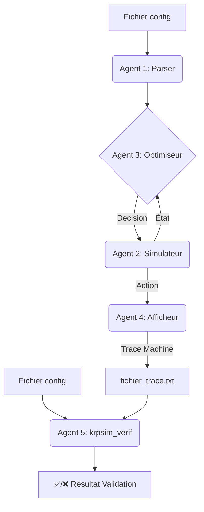

# 🚀 KRPSIM — Simulateur de Processus & Optimiseur 42


[MIT](https://opensource.org/licenses/MIT)
[Python](https://www.python.org/)

> **KRPSIM** est un projet algorithmique d’optimisation et de recherche opérationnelle (42), porté à un standard professionnel.
> Le programme lit une description de stocks et de processus, puis calcule une séquence d’actions optimisée pour maximiser un rendement ou minimiser un délai.
> **Architecture en agents, TDD strict, CI/CD totale, robustesse Loi de Murphy, couverture 100%.**

---

## Sommaire

* [✨ Fonctionnalités Clés](#-fonctionnalités-clés)
* [🏗️ Architecture Agents & Design](#-architecture-agents--design)
* [⚙️ Installation & Démarrage Rapide](#-installation--démarrage-rapide)
* [📄 Exemple de Fichier de Config](#-exemple-de-fichier-de-config)
* [🖥️ Utilisation (Simulation & Vérification)](#-utilisation-simulation--vérification)
* [🧪 Qualité, Tests & Loi de Murphy](#-qualité-tests--loi-de-murphy)
* [📂 Structure du Projet](#-structure-du-projet)
* [🛣️ Roadmap & Bonus](#-roadmap--bonus)
* [🤝 Contribution & Guidelines](#-contribution--guidelines)
* [❓ FAQ & Support](#-faq--support)
* [📜 Licence](#-licence)

---

## ✨ Fonctionnalités Clés

* **Parsing Ultra-Robuste** : Validation stricte de la syntaxe, des dépendances logiques, de l’encodage et des formats. Messages d’erreur détaillés et explicites ([sujet 42](#)).
* **Simulation par Événements Discrets** : Moteur orchestrant l’état des stocks, l’exécution concurrente des processus, gestion fine du temps/cycles.
* **Optimisation Stratégique** : Agent de décision calculant la séquence d’actions optimale selon le critère (`time` ou maximisation de stocks).
* **Validation de Trace** : Programme utilitaire (`krpsim_verif`) vérifiant la conformité de toute trace de simulation avec le fichier de config initial.
* **Affichage Double** : Sortie lisible pour l’utilisateur **et** format machine pour la vérification automatique.
* **Qualité Industrielle** : 100% de couverture de tests, CI/CD complète, formatage/lint strict, analyse statique (mypy, ruff, bandit…).
* **Crash & Stress Tests** : Fuzzing, SIGINT, fichiers corrompus, gestion disque/logs/droits.
* **Documenté, Actionnable, Onboardant** : Tout est prêt pour prise en main rapide, évaluation ou contribution pro.

---

## 🏗️ Architecture Agents & Design

KRPSIM repose sur **5 agents** ultra-spécialisés :
*(Design inspiré SOLID, chaque agent a un rôle unique pour la robustesse, la lisibilité, et la maintenabilité)*



* **Agent 1 (parser.py)** : Analyseur syntaxique strict, refuse tout fichier non conforme, validation du format/encodage/stock/process ([sujet p.7](#)).
* **Agent 2 (simulator.py)** : Orchestre la simulation, applique chaque process en tenant compte des stocks, cycles et règles métier.
* **Agent 3 (optimizer.py)** : Décide à chaque cycle l’action optimale en fonction de l’état courant (algorithme de sélection, stratégie d’exécution, [sujet p.6-7](#)).
* **Agent 4 (display.py)** : Affiche de manière claire pour l’utilisateur, tout en générant la trace machine conforme pour vérification.
* **Agent 5 (krpsim\_verif.py)** : Vérifie toute trace de simulation, détecte la moindre incohérence, donne le diagnostic exact (cycle/process fautif, stocks finaux, [sujet p.8](#)).

---

## ⚙️ Installation & Démarrage Rapide

### Prérequis

* Python **3.10+**
* [Poetry](https://python-poetry.org/docs/)

### Installation

```bash
git clone https://github.com/USERNAME/krpsim.git
cd krpsim
poetry install
```

### Quickstart Simulation

```bash
poetry run krpsim resources/simple 10
```

### Vérification de trace

```bash
poetry run krpsim_verif resources/simple my_trace.txt
```

---

## 📄 Exemple de Fichier de Config

```txt
# very simple demo - krpsim
euro:10
equipment_purchase:(euro:8):(equipment:1):10
product_creation:(equipment:1):(product:1):30
delivery:(product:1):(happy_client:1):20
optimize:(time;happy_client)
```

**Sortie attendue** (extrait du sujet) :

```
Nice file! 3 processes, 4 stocks, 1 to optimize
Evaluating ... done.
Main walk
0:equipment_purchase
10:product_creation
40:delivery
no more process doable at time 61
Stock:
happy_client => 1
product => 0
equipment => 0
euro => 2
```

⚠️ **Limite de délai** : le paramètre `<delai>` représente une borne supérieure
exclusive. Les cycles s'exécutent tant que `time < delai`. Pour aller au bout
de tous les processus, fournissez un délai strictement plus grand que la durée
totale ou utilisez l'option `--run-all`.

---

## 🖥️ Utilisation (Simulation & Vérification)

* **Simulation :**

  ```bash
  poetry run krpsim <chemin_fichier_config> <delai_max>
  ```

  `<delai_max>` est une borne exclusive : la simulation s'arrête dès que
  `time` est supérieur ou égal à cette valeur. Pour exécuter tous les
  processus, utilisez un délai supérieur à la durée totale ou passez `--run-all`.
* **Vérification de trace :**

  ```bash
  poetry run krpsim_verif <chemin_fichier_config> <fichier_trace>
  ```

  Le vérifieur indique si la progression est correcte, sinon précise le cycle/process fautif.

---

## 🧪 Qualité, Tests & Loi de Murphy

### **Politique Qualité**

* **Tests unitaires/intégration/extremes** : 100% couverture, chaque branche, chaque condition.
* **Crash/fuzzing** : Le système est testé sur : fichiers vides, corrompus, mauvais encoding, valeurs aberrantes, etc.
* **Analyse statique & sécurité** : `black`, `ruff`, `mypy`, `bandit` (fail pipeline si défaut).
* **CI/CD** : Pipeline GitHub Actions automatisé (installation, lint, test, coverage, sécurité).
* **Formatage & documentation** : Norme stricte, docstring pour chaque agent, README à jour.

### **Loi de Murphy — Table de mitigation**

| Problème Potentiel                   | Mitigation Implémentée                                   |
| ------------------------------------ | -------------------------------------------------------- |
| Fichier absent/corrompu/non lisible  | Gestion d’erreur explicite, exit code non nul, log clair |
| Encodage (UTF-8, BOM, CRLF)          | Détection automatique, conversion, refus si non géré     |
| Syntaxe/process/config invalides     | Parsing strict, refus explicite, logs détaillés          |
| Deadlock, boucle infinie, starvation | Watchdog interne, arrêt au délai imparti, logs           |
| Explosion mémoire / input géant      | Profiling, parsing incrémental, limitation RAM           |
| Crash pendant logs/traces            | Flush régulier, try/except sur I/O, intégrité sauvegarde |
| CLI/args manquants/invalides         | Usage clair, exit code, message explicite                |
| Documentation absente/obsolète       | README/pyproject.toml/docstring, checklist pipeline      |

```bash
# Lancer tous les tests et voir le rapport de couverture
make test
# ou
poetry run pytest --cov=src --cov-fail-under=100
```

---

## 📂 Structure du Projet

```
krpsim/
├── .github/workflows/ci.yml      # Pipeline CI/CD (install, lint, tests, coverage, security)
├── krpsim.py                    # Simulateur principal (entrée CLI)
├── krpsim_verif.py              # Vérificateur (entrée CLI)
├── src/
│   ├── parser.py                # Agent 1 — Parsing & validation
│   ├── simulator.py             # Agent 2 — Simulation cycle/cycle
│   ├── optimizer.py             # Agent 3 — Décision/stratégie
│   ├── display.py               # Agent 4 — Affichage & trace
│   └── __init__.py
├── tests/
│   ├── test_parser.py
│   ├── test_simulator.py
│   └── test_verifier.py
├── resources/                   # Fichiers de config tests (cas nominaux, crash, stress, forever)
├── Makefile                     # Commandes (install, test, lint…)
├── pyproject.toml               # Dépendances et configuration
├── LICENSE
├── author
└── README.md
```

---

## 🛣️ Roadmap & Bonus

* [ ] Optimisation avancée (heuristiques, IA, bonus)
* [ ] Support multi-thread/gros fichiers
* [ ] Interface CLI avancée (mode verbose, export de logs)
* [ ] Fuzzing et crash tests cross-platform
* [ ] Documentation multilingue

---

## 🤝 Contribution & Guidelines

1. **Créez une branche** (`git checkout -b feat/nom-feature`)
2. **Respectez l’architecture agents et la qualité** (100% tests, lint, docstring à jour)
3. **Vérifiez que la CI est verte avant PR**
4. **PR atomique, claire, changelog/documentation mis à jour**
5. **Pair review obligatoire avant merge**

---

## ❓ FAQ & Support

**Q : Que faire si la simulation ne s’arrête jamais ?**
R : Le watchdog arrête toujours le programme au délai imparti. Si ça boucle avant, c’est qu’il n’y a plus d’action possible.

**Q : Comment vérifier une trace ?**
R : Utilisez `krpsim_verif <config> <trace>`, le programme indique la conformité et le cycle problématique en cas d’échec.

**Q : Les résultats sont-ils toujours identiques ?**
R : Non, invariance non requise : des solutions différentes peuvent être produites à chaque run ([sujet](#)).

**Q : Qui contacter ?**
Auteur : *raveriss* — [ton.email@provider.com](mailto:ton.email@provider.com)

---

## 📜 Licence

Ce projet est distribué sous licence **MIT**. Voir le fichier `LICENSE`.
