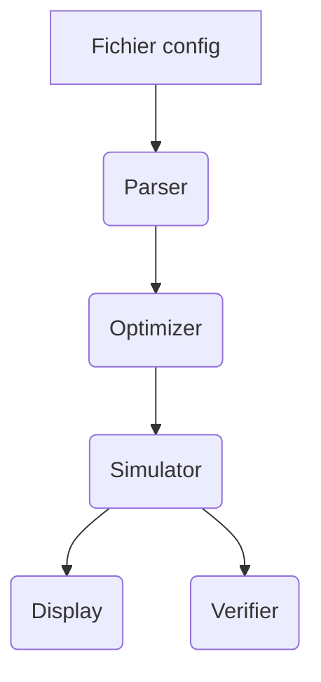

# krpsim

<div align="center">


[](https://github.com/raveriss/krpsim/actions)
[](https://codecov.io/gh/raveriss/krpsim)


</div>


## 🚀 Objectif du projet

**krpsim** est un simulateur de processus inspiré du projet 42. Le programme lit un fichier de configuration de stocks et de processus puis produit une trace optimisée de leur exécution.

## 🧰 Stack technologique

Projet Python >=3.10 construit avec [Poetry](https://python-poetry.org/). Les dépendances principales sont listées dans `pyproject.toml` :

```toml
[tool.poetry.dependencies]
python = ">=3.10,<3.13"
```

Les outils de développement incluent `pytest`, `ruff`, `black`, `isort` et `mypy`.

## ⚡ Démarrage rapide

```bash
poetry install
poetry run krpsim resources/simple 10
```

## 🔧 Installation

### Depuis PyPI

```bash
pip install krpsim
```
### Depuis les sources

```bash
git clone https://github.com/raveriss/krpsim.git
cd krpsim
poetry install
```

Pour un mode développement, utilisez un environnement virtuel `poetry shell`.

## ▶️ Lancement

```bash
poetry run krpsim path/to/config delay
poetry run krpsim_verif path/to/config trace.txt
```

### Lancement via Makefile

```bash
make krpsim resources/simple 10
make krpsim_verif resources/simple trace.txt
make process-resources
```

Les arguments fournis après la cible sont transmis au binaire.


## 📦 Utilisation

La CLI accepte un fichier de configuration et un délai maximal. Un exemple minimal de configuration se trouve dans `resources/simple` :

```txt
euro:10
achat_materiel:(euro:8):(materiel:1):10
realisation_produit:(materiel:1):(produit:1):30
```

## ⚙️ Utilisation avancée

Consultez `krpsim --help` pour l'ensemble des options disponibles.

## 🔌 Injection de dépendances

```python
from krpsim.simulator import Simulator
sim = Simulator(config)
```

Plus de détails dans `AGENTS.md`.

## 📈 Collecte de métriques

```python
from krpsim.display import format_trace
for line in format_trace(trace):
    print(line)
```

## ❗ Gestion des erreurs

Les erreurs de parsing lèvent `ParseError`.

```python
from krpsim.parser import parse_file, ParseError
try:
    cfg = parse_file(path)
except ParseError as exc:
    print(f"invalid config: {exc}")
```

## 📝 Formats d'entrée

Les fichiers de configuration décrivent les stocks initiaux puis les processus sous forme `name:(need):(result):delay`.

## 🧠 Architecture

Un schéma mermaid simplifié illustre l'architecture en agents :



Les rôles détaillés sont décrits dans `AGENTS.md`.

## 📂 Structure du Projet

```
.
├── AGENTS.md
├── author
├── codecov.yml
├── docs
│   └── badges
│       └── version.json
├── gantt_project
│   └── gantt.py
├── install.txt
├── junit.xml
├── krpsim.en.subject.pdf
├── LICENSE
├── log.txt
├── Lois de Murphy.KRPSIM.txt
├── Makefile
├── poetry.lock
├── pyproject.toml
├── README.md
├── resources
│   ├── best
│   ├── custom_finite
│   ├── custom_infinite
│   ├── duplicate_entries
│   ├── exponential
│   ├── ikea
│   ├── inception
│   ├── invalid_bad_process
│   ├── invalid_bad_stock
│   ├── large_numbers
│   ├── missing_input
│   ├── multi_output_chain
│   ├── pomme
│   ├── recre
│   ├── self_gen
│   ├── simple
│   ├── steak
│   ├── unreachable_target
│   ├── zero_delay
│   └── zero_initial
├── resources.tgz
├── src
│   ├── krpsim
│   │   ├── cli.py
│   │   ├── display.py
│   │   ├── __init__.py
│   │   ├── optimizer.py
│   │   ├── parser.py
│   │   └── simulator.py
│   └── krpsim_verif
│       ├── cli.py
│       ├── __init__.py
│       └── verifier.py
├── tests
│   ├── __init__.py
│   ├── test_cli.py
│   ├── test_display.py
│   ├── test_parser_hypothesis.py
│   ├── test_parser.py
│   ├── test_simulator.py
│   ├── test_verifier.py
│   └── test_version.py
└── WBS_krpsim.txt
```

## 🛠️ Fichiers de configuration

Les principaux réglages (`black`, `isort`, `mypy`, `pytest`) se trouvent dans `pyproject.toml`.


## 🧪 Tests

```bash
make test
```

La configuration `pytest` impose une couverture minimale de 100 % :

```toml
[tool.pytest.ini_options]
--cov=krpsim
--cov=krpsim_verif
--cov-fail-under=100
```

## 🔍 Qualité du code

* **Formatage** : `black` et `isort`.
* **Lint** : `ruff`.
* **Typage** : `mypy`.
* **Hooks** : `pre-commit`.

## 🤝 Contribuer

Les règles de contribution sont détaillées dans `AGENTS.md`. Toute PR doit passer la CI et maintenir la couverture à 100 %.

## 📚 Documentation liée

* [AGENTS.md](AGENTS.md) – blueprint du projet.
* [krpsim.en.subject.pdf](krpsim.en.subject.pdf) – énoncé original.

## 📊 Diagramme de Gantt

Pour visualiser l'ordonnancement des tâches :

- Installation des dépendances : `pip install pandas matplotlib` (ou `poetry add pandas matplotlib`).
- Commande d’exécution : `poetry run python gantt_project/gantt.py`.

Le script utilise des données d’exemple et peut être adapté pour parser une trace réelle.


## 🛡️ Licence

Projet distribué sous licence MIT.
