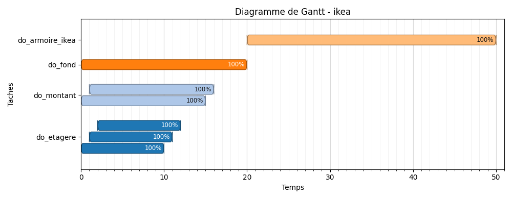

# Production Process Simulator & Verifier (Python) - KRPSIM

<div align="center">

[](https://github.com/raveriss/krpsim/actions/workflows/ci.yml)
[](https://codecov.io/gh/raveriss/krpsim)


</div>

KRPSIM est un simulateur d'ordonnancement de processus avec vérification de trace. Le projet lit une configuration de stocks/processus, calcule une exécution optimisée et permet de vérifier la cohérence d'une trace d'exécution.

## 🧭 Table des matières

- [🎯 Objectif du projet](#objectif-du-projet)
- [🧩 Fonctionnalités principales](#fonctionnalités-principales)
- [🧰 Stack](#stack)
- [⚙️ Installation (source)](#installation-source)
- [🚀 Quick Start](#quick-start)
- [📋 Tableau des commandes make](#tableau-des-commandes-make)
- [📝 Formats d'entrée](#formats-entree)
- [🖥️ Exemple de sortie: simulation](#exemple-de-sortie-simulation)
- [✅ Exemple de sortie: vérification + graphe](#exemple-de-sortie-vérification--graphe)
- [📊 Visualisation Gantt](#visualisation-gantt)
- [🗂️ Structure du projet](#structure-du-projet)
- [🧪 Tests](#tests)
- [🔍 Qualité du code](#qualite-du-code)
- [📚 Documentation](#documentation)
- [👥 Auteurs](#auteurs)
- [🛡️ Licence](#licence)

## 🎯 Objectif du projet

Projet réalisé dans le cadre du cursus **École 42** (projet KRPSIM), avec un objectif d'ingénierie logicielle: parser une grammaire métier, ordonnancer des processus de façon déterministe et valider les sorties.

## 🧩 Fonctionnalités principales

- Simulation d'un flux de production à ressources contraintes.
- Optimisation multi-critères (temps, stock cible).
- Vérification automatique d'une trace (auditabilité d'exécution).
- Génération d'une configuration exploitable pour visualisation Gantt.

## 🧰 Stack

- **Langage & packaging** : Python `>=3.10,<3.13`, Poetry
- **Runtime** : pandas, matplotlib
- **Tests** : pytest, pytest-cov, Hypothesis
- **Qualité** : Ruff, MyPy, Black, isort, pre-commit

## ⚙️ Installation (source)

```bash
git clone https://github.com/raveriss/krpsim.git
cd krpsim
make install
```

`make install` installe automatiquement Poetry (si absent), crée le virtualenv et installe les dépendances.

## 🚀 Quick Start

```bash
make krpsim resources/ikea 10
make krpsim_verif resources/ikea trace_ikea.txt
```

## 📋 Tableau des commandes make

| Commande | Description |
| --- | --- |
| `make` | Installation complète (`install` + `install-bin`) |
| `make install` | Installe Poetry (si absent) et les dépendances |
| `make install-bin` | Crée les symlinks `krpsim` / `krpsim_verif` dans `~/.local/bin` |
| `make krpsim <resource_file> <max_cycles>` | Lance la simulation |
| `make krpsim_verif <resource_file> <trace_file>` | Vérifie une trace |
| `make graph` | Génère le graphe Gantt |
| `make test` | Exécute les tests |
| `make lint` | Exécute le lint et le typage |
| `make format` | Formate le code (`black`, `isort`) |
| `make process_resources` | Batch sur tous les fichiers de `resources` |
| `make clean` | Nettoie les artefacts temporaires |
| `make fclean` | Nettoyage complet (inclut venv et Poetry user) |
| `make doctor` | Vérifie l’état de l’environnement |
| `make help` | Affiche l’aide des cibles |

<a id="formats-entree"></a>

## 📝 Formats d'entrée

Les fichiers de configuration décrivent les stocks initiaux puis les processus sous forme `name:(need):(result):delay`.
La durée `delay` d'un processus doit être strictement positive (`>= 1`).
Une durée `:0` est rejetée avec un message explicite indiquant comment corriger la ligne.

Exemple (`resources/ikea`):

```txt
#
# ikea demo - krpsim
#
# stock      name:quantity
planche:7
#
# process   name:(need1:qty1;need2:qty2;[...]):(result1:qty1;result2:qty2;[...]):delay
#
do_montant:(planche:1):(montant:1):15
do_fond:(planche:2):(fond:1):20
do_etagere:(planche:1):(etagere:1):10
do_armoire_ikea:(montant:2;fond:1;etagere:3):(armoire:1):30
#
# optimize time for 0 stock and no process possible,
# or maximize some products over a long delay
# optimize:(stock1;stock2;...)
#
optimize:(time;armoire)
#
```

## 🖥️ Exemple de sortie: simulation

```bash
make krpsim resources/ikea 10
[KRPSIM] Exécution: file=resources/ikea, max_cycles=10
[KRPSIM] Trace de sortie: trace_ikea.txt
[KRPSIM] Config graphe: graph_config_ikea.json
Nice file! 4 processes, 5 stocks, 1 to optimize
Evaluating ... done.
Main walk:
Optimization criteria: time, armoire
0:do_etagere
0:do_montant
0:do_fond
1:do_etagere
1:do_montant
2:do_etagere
20:do_armoire_ikea
No more process doable at time 51
Final Stocks:
  armoire  => 1
  etagere  => 0
  fond     => 0
  montant  => 0
  planche  => 0
[GRAPH_CONFIG] Fichier genere: graph_config_ikea.json
```

## ✅ Exemple de sortie: vérification + graphe

```bash
make krpsim_verif resources/ikea trace_ikea.txt
[KRPSIM_VERIF] Vérification: file=resources/ikea, trace=trace_ikea.txt
trace is valid
Final Stocks:
  armoire  => 1
  etagere  => 0
  fond     => 0
  montant  => 0
  planche  => 0
Last cycle: 51
[GRAPH_CONFIG] Fichier genere: graph_config_ikea.json
[GRAPH] Génération du graphe Gantt
```

## 📊 Visualisation Gantt

Exemple de diagramme généré à partir du cas `resources/ikea`:

<div align="center">
  
</div>

## 🗂️ Structure du projet

Commande utilisée:

```bash
tree -L 2
```

Sortie:

```txt
.
├── author
├── codecov.yml
├── docs
│   ├── AGENTS.md
│   ├── diagramme_gantt_ikea.png
│   ├── diagramme_gantt_simple.png
│   ├── krpsim.en.subject.pdf
│   ├── Lois de Murphy.KRPSIM.txt
│   ├── optimize_marelle-bonbon.png
│   ├── optimize_marelle.png
│   ├── optimize_stock1.png
│   ├── optimize_stock1-stock2.png
│   ├── optimize_stock2-stock1.png
│   ├── optimize_time-marelle.png
│   ├── pipeline.md
│   └── WBS_krpsim.txt
├── gantt_project
│   ├── build_graph_config.py
│   └── gantt.py
├── graph_config_ikea.json
├── graph_config_simple.json
├── LICENSE
├── Makefile
├── poetry.lock
├── pyproject.toml
├── README.md
├── resources
│   ├── best
│   ├── custom_finite
│   ├── custom_infinite
│   ├── duplicate_entries
│   ├── exponential
│   ├── ikea
│   ├── inception
│   ├── invalid_bad_process
│   ├── invalid_bad_stock
│   ├── large_numbers
│   ├── missing_input
│   ├── multi_output_chain
│   ├── pomme
│   ├── recre
│   ├── self_gen
│   ├── simple
│   ├── steak
│   ├── stress_lexicographic_finite
│   ├── stress_multi_objective
│   ├── unreachable_target
│   ├── zero_delay
│   └── zero_initial
├── src
│   ├── krpsim
│   └── krpsim_verif
├── tests
│   ├── __init__.py
│   ├── test_cli.py
│   ├── test_display.py
│   ├── test_graph_pipeline.py
│   ├── test_parser_hypothesis.py
│   ├── test_parser.py
│   ├── test_simulator.py
│   ├── test_verifier.py
│   └── test_version.py
├── trace_ikea.txt
└── trace_simple.txt

7 directories, 57 files
```

<a id="tests"></a>

## 🧪 Tests

```bash
make test
```

<a id="qualite-du-code"></a>

## 🔍 Qualité du code

* **Formatage** : `black` et `isort`.
* **Lint** : `ruff`.
* **Typage** : `mypy`.
* **Hooks** : `pre-commit`.

## 📚 Documentation

- [Pipeline global](docs/pipeline.md)
- [Sujet du projet 42 (PDF)](docs/krpsim.en.subject.pdf)

## 👥 Auteurs

- **Rafael Verissimo** — [LinkedIn](https://www.linkedin.com/in/verissimo-rafael/) · [GitHub](https://github.com/raveriss)

## 🛡️ Licence

Projet distribué sous licence MIT.
