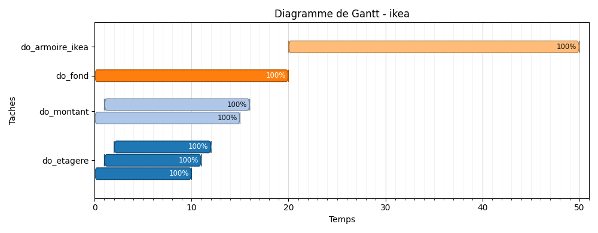

# ⏱️ Production Process Simulator & Verifier (Python) - KRPSIM

<div align="center">

[](https://github.com/raveriss/krpsim/actions/workflows/ci.yml)
[](https://codecov.io/gh/raveriss/krpsim)


[](https://docs.astral.sh/uv/)


</div>

##### Ce projet fait partie de mon [`🔗 PORTFOLIO`](https://raveriss.dev/) orienté **Data / IA / Software Engineering**

KRPSIM est un simulateur d'ordonnancement de processus avec vérification de trace. Le projet lit une configuration de stocks/processus, calcule une exécution optimisée et permet de vérifier la cohérence d'une trace d'exécution.

## 🧭 Table des matières

- [🎯 Objectif du projet](#objectif-du-projet)
- [🧩 Fonctionnalités principales](#fonctionnalités-principales)
- [🧰 Stack](#stack)
- [⚙️ Installation (source)](#installation-source)
- [🚀 Quick Start](#quick-start)
- [📋 Tableau des commandes make](#tableau-des-commandes-make)
- [📝 Formats d'entrée](#formats-entree)
- [🖥️ Exemple de sortie: simulation](#exemple-de-sortie-simulation)
- [✅ Exemple de sortie: vérification + graphe](#exemple-de-sortie-vérification--graphe)
- [📊 Visualisation Gantt](#visualisation-gantt)
- [🗂️ Structure du projet](#structure-du-projet)
- [🧪 Tests](#tests)
- [🔍 Qualité du code](#qualite-du-code)
- [📚 Documentation](#documentation)
- [👥 Auteurs](#auteurs)
- [🛡️ Licence](#licence)

## 🎯 Objectif du projet

Projet réalisé dans le cadre du cursus **École 42** (projet KRPSIM), avec un objectif d'ingénierie logicielle: parser une grammaire métier, ordonnancer des processus de façon déterministe et valider les sorties.

## 🧩 Fonctionnalités principales

- Simulation d'un flux de production à ressources contraintes.
- Optimisation multi-critères (temps, stock cible).
- Vérification automatique d'une trace (auditabilité d'exécution).
- Génération d'une configuration exploitable pour visualisation Gantt.

## 🧰 Stack

- **Langage & packaging** : Python `>=3.10,<3.14`, uv, Hatchling
- **Runtime** : pandas, matplotlib
- **Tests** : pytest, pytest-cov, Hypothesis
- **Qualité** : Ruff, MyPy, Black, isort, pre-commit

## ⚙️ Installation (source)

```bash
git clone https://github.com/raveriss/krpsim.git
cd krpsim
curl -LsSf https://astral.sh/uv/install.sh | sh
make install
```

Python `3.13` est la version de développement recommandée et elle est déclarée dans
`.python-version`. Le projet reste compatible avec Python `>=3.10,<3.14`. Lors de la
synchronisation, uv utilise cette version et peut la télécharger si elle n'est pas
encore disponible.

Pour installer explicitement l'interpréteur avant la synchronisation :

```bash
uv python install 3.13
make install
```

`make install` vérifie la présence de uv, crée `.venv` et synchronise exactement les
dépendances verrouillées dans `uv.lock`. La commande `make` effectue cette même
installation locale au projet, sans écrire dans `~/.local/bin`. La cible facultative
`make install-bin` permet d'exposer explicitement `krpsim` et `krpsim_verif` dans
`~/.local/bin`. Les autres cibles Make exécutent les outils dans cet environnement ;
vous pouvez donc lancer directement `make krpsim ...`, `make krpsim_verif ...` ou
`make test`.
`make shell` ouvre un shell interactif dans le virtualenv pour le debug manuel et
`make doctor` contrôle uv, Python, le lockfile et l'environnement.

### Utilisation directe de uv

Le même environnement peut être synchronisé et utilisé sans Make :

```bash
uv sync --locked
uv run --locked krpsim resources/ikea 10
uv run --locked krpsim_verif resources/ikea trace_ikea.txt
uv run --locked pytest
```

L'option `--locked` garantit que ces commandes n'altèrent pas `uv.lock` et échoue si
le lockfile n'est plus cohérent avec `pyproject.toml`.

## 🚀 Quick Start

```bash
make krpsim resources/ikea 10
make krpsim_verif resources/ikea trace_ikea.txt
```

## 📋 Tableau des commandes make

| Commande | Description |
| --- | --- |
| `make` | Synchronise le projet dans `.venv`, sans écrire dans le dossier personnel |
| `make install` | Synchronise `.venv` depuis `uv.lock` avec uv |
| `make install-bin` | Crée les symlinks `krpsim` / `krpsim_verif` dans `~/.local/bin` |
| `make shell` | Ouvre un shell interactif dans le virtualenv |
| `make krpsim <resource_file> <max_cycles>` | Lance la simulation |
| `make krpsim_verif <resource_file> <trace_file>` | Vérifie une trace |
| `make graph` | Génère le graphe Gantt |
| `make test` | Exécute les tests |
| `make lint` | Exécute le lint et le typage |
| `make format` | Formate le code (`black`, `isort`) |
| `make process_resources` | Batch sur tous les fichiers de `resources` |
| `make clean` | Nettoie les artefacts temporaires |
| `make fclean` | Nettoyage complet, y compris `.venv` |
| `make doctor` | Vérifie uv, Python, `uv.lock` et l'état de l'environnement |
| `make help` | Affiche l’aide des cibles |

<a id="formats-entree"></a>

## 📝 Formats d'entrée

Les fichiers de configuration décrivent les stocks initiaux puis les processus sous forme `name:(need):(result):delay`.
La durée `delay` d'un processus doit être positive ou nulle. Une durée `:0`
décrit un processus instantané : ses besoins sont consommés et ses résultats
sont crédités au même cycle.

### Ordonnancement et optimisation

L'ordonnanceur construit le graphe inverse des ressources à partir des cibles
`optimize`. Il compare les producteurs selon le gain lexicographique attendu,
la consommation de ressources et la durée, puis développe leurs dépendances en
lots. Les stocks intermédiaires, sous-produits et ressources réutilisables sont
pris en compte sans dépendre des noms présents dans la configuration.

Un même processus peut être lancé plusieurs fois au même cycle. Les processus
instantanés sont exécutés jusqu'à la multiplicité utile, avec une protection
contre les boucles instantanées sans progression. Lorsqu'un convertisseur final
instantané est détecté, sa ressource d'entrée reste disponible comme fonds de
roulement pendant la production et n'est convertie qu'à la fin.

Le vérificateur rejoue directement la trace fournie : il accepte donc tout
ordonnancement valide, y compris les répétitions au même cycle et les solutions
différentes de celle choisie par `krpsim`.

Exemple (`resources/ikea`):

```txt
#
# ikea demo - krpsim
#
# stock      name:quantity
planche:7
#
# process   name:(need1:qty1;need2:qty2;[...]):(result1:qty1;result2:qty2;[...]):delay
#
do_montant:(planche:1):(montant:1):15
do_fond:(planche:2):(fond:1):20
do_etagere:(planche:1):(etagere:1):10
do_armoire_ikea:(montant:2;fond:1;etagere:3):(armoire:1):30
#
# optimize time for 0 stock and no process possible,
# or maximize some products over a long delay
# optimize:(stock1;stock2;...)
#
optimize:(time;armoire)
#
```

## 🖥️ Exemple de sortie: simulation

```bash
make krpsim resources/ikea 10
[KRPSIM] Exécution: file=resources/ikea, max_cycles=10
[KRPSIM] Trace de sortie: trace_ikea.txt
[KRPSIM] Config graphe: graph_config_ikea.json
Nice file! 4 processes, 5 stocks, 1 to optimize
Evaluating ... done.
Main walk:
Optimization criteria: time, armoire
0:do_etagere
0:do_montant
0:do_fond
1:do_etagere
1:do_montant
2:do_etagere
20:do_armoire_ikea
No more process doable at time 51
Final Stocks:
  armoire  => 1
  etagere  => 0
  fond     => 0
  montant  => 0
  planche  => 0
[GRAPH_CONFIG] Fichier genere: graph_config_ikea.json
```

## ✅ Exemple de sortie: vérification + graphe

```bash
make krpsim_verif resources/ikea trace_ikea.txt
[KRPSIM_VERIF] Vérification: file=resources/ikea, trace=trace_ikea.txt
trace is valid
Final Stocks:
  armoire  => 1
  etagere  => 0
  fond     => 0
  montant  => 0
  planche  => 0
Last cycle: 51
[GRAPH_CONFIG] Fichier genere: graph_config_ikea.json
[GRAPH] Génération du graphe Gantt
```

## 📊 Visualisation Gantt

Exemple de diagramme généré à partir du cas `resources/ikea`:

Sur un environnement sans affichage graphique interactif (par exemple Fedora avec
le backend Matplotlib `Agg`), le graphe est sauvegardé dans
`docs/graphs/diagramme_gantt_<nom>.png`.
Les commandes `make krpsim_verif`, `make graph` et `make analysis_log_gantt_project`
ouvrent automatiquement ce fichier quand un ouvreur système est disponible.
Pour générer sans ouvrir l'image:

```bash
KRPSIM_OPEN_GRAPH=0 make krpsim_verif resources/ikea trace_ikea.txt
```

<div align="center">
  
</div>

## 🗂️ Structure du projet

Commande utilisée:

```bash
tree -L 2
```

Sortie:

```txt
.
├── .python-version
├── author
├── codecov.yml
├── docs
│   ├── AGENTS.md
│   ├── diagramme_gantt_ikea.png
│   ├── diagramme_gantt_simple.png
│   ├── krpsim.en.subject.pdf
│   ├── Lois de Murphy.KRPSIM.txt
│   ├── optimize_marelle-bonbon.png
│   ├── optimize_marelle.png
│   ├── optimize_stock1.png
│   ├── optimize_stock1-stock2.png
│   ├── optimize_stock2-stock1.png
│   ├── optimize_time-marelle.png
│   ├── pipeline.md
│   └── WBS_krpsim.txt
├── gantt_project
│   ├── build_graph_config.py
│   └── gantt.py
├── graph_config_ikea.json
├── graph_config_simple.json
├── LICENSE
├── Makefile
├── pyproject.toml
├── README.md
├── resources
│   ├── bad_proc
│   ├── bad_ref
│   ├── bad_stock
│   ├── best
│   ├── big
│   ├── delay0
│   ├── dup
│   ├── expo
│   ├── finite
│   ├── gantt_x
│   ├── gantt_y
│   ├── greedy
│   ├── ikea
│   ├── init0
│   ├── lexi
│   ├── loop
│   ├── multi_out
│   ├── no_goal
│   ├── obj2
│   ├── pomme
│   ├── recre
│   ├── self
│   ├── simple
│   ├── steak
│   └── time
├── src
│   ├── krpsim
│   └── krpsim_verif
├── tests
│   ├── __init__.py
│   ├── test_cli.py
│   ├── test_display.py
│   ├── test_graph_pipeline.py
│   ├── test_parser_hypothesis.py
│   ├── test_parser.py
│   ├── test_simulator.py
│   ├── test_verifier.py
│   └── test_version.py
├── trace_ikea.txt
├── trace_simple.txt
└── uv.lock

7 directories, 57 files
```

<a id="tests"></a>

## 🧪 Tests

```bash
make test
```

<a id="qualite-du-code"></a>

## 🔍 Qualité du code

* **Formatage** : `black` et `isort`.
* **Lint** : `ruff`.
* **Typage** : `mypy`.
* **Hooks** : `pre-commit`.

## 📚 Documentation

- [Pipeline global](docs/pipeline.md)
- [Sujet du projet 42 (PDF)](docs/krpsim.en.subject.pdf)

## 👥 Auteurs

- **Rafael VERISSIMO** — [Portfolio](https://raveriss.dev/) · [LinkedIn](https://www.linkedin.com/in/verissimo-rafael/) · [GitHub](https://github.com/raveriss)
- **Paul BEAUDET** — [LinkedIn](https://www.linkedin.com/in/paul-beaudet-968860385/) · [GitHub](https://github.com/PaulBeaudet23)
- **Sylvanna COURBIS** — [GitHub](https://github.com/Sycourbi)
  
## 🛡️ Licence

Projet distribué sous licence MIT.
